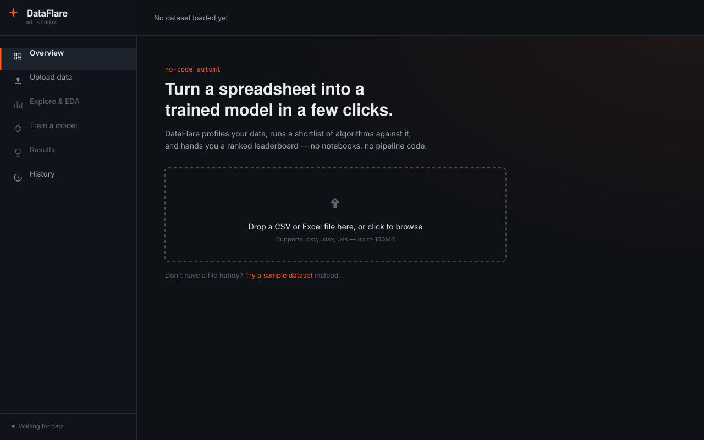
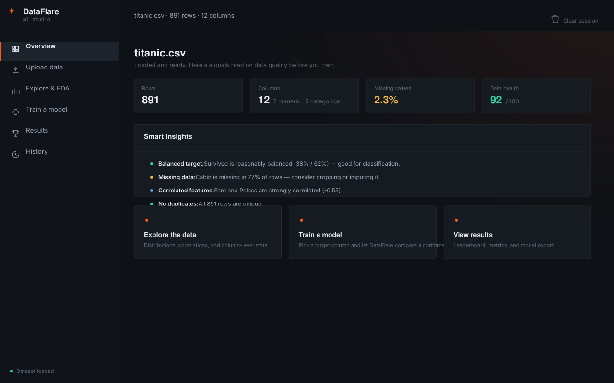
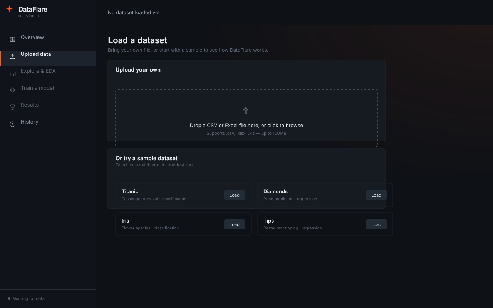
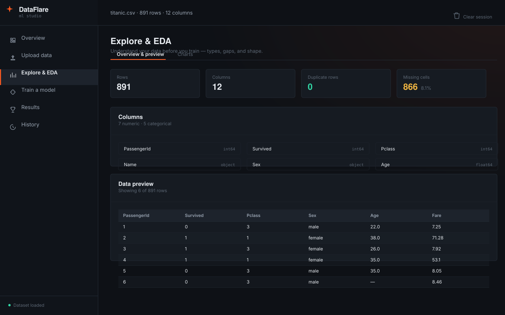
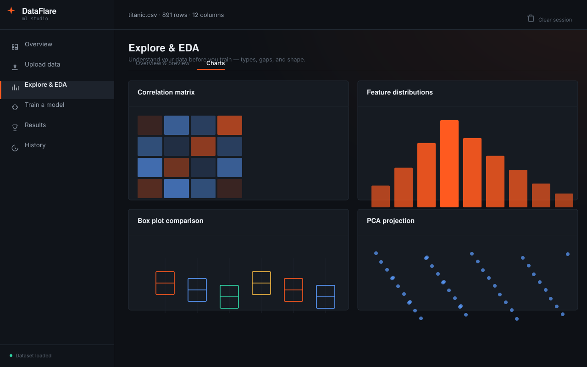
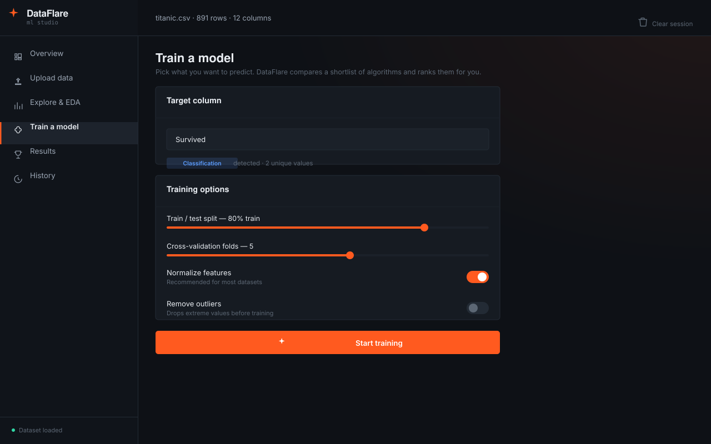
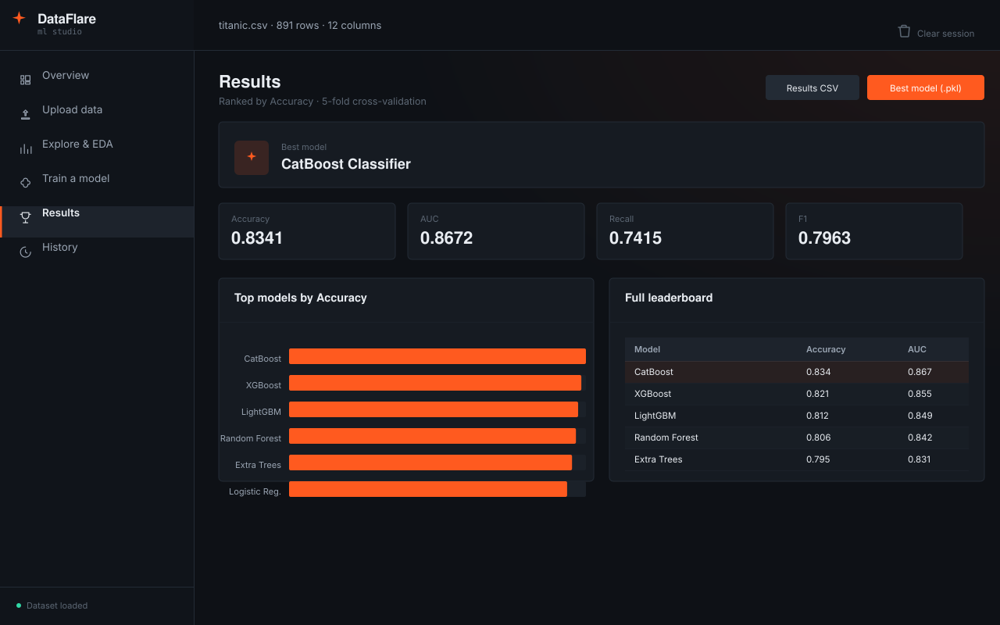
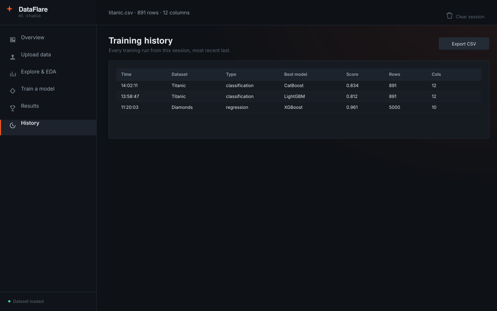

# DataFlare ML Studio

A production-ready, no-code AutoML workbench: upload a spreadsheet, explore it, and train/compare machine learning models — no notebooks, no boilerplate, no single line of ML code required.

This rebuild splits the original single Flask app into two pieces:

- **`backend/`** — the original Flask + PyCaret AutoML engine (unchanged logic), now exposed as a clean JSON API with CORS support.
- **`frontend/`** — a new **Next.js 14 + TypeScript + Tailwind** interface that replaces the old server-rendered HTML/jQuery UI.

The ML training itself (PyCaret, XGBoost, LightGBM, CatBoost, scikit-learn) has to stay in Python — there's no equivalent of these libraries in JavaScript — so the frontend is a pure API client rather than a full rewrite of the ML pipeline.

---


## Screens

**Overview — before a dataset is loaded**


**Overview — after a dataset is loaded**


**Upload — bring your own file or pick a sample dataset**


**Explore & EDA — profiling and preview**


**Explore & EDA — charts**


**Train a model — target selection and options**


**Results — leaderboard and metrics**


**History — every run this session**


---

## Features

### Data Exploration
- **Upload & Preview** — support for CSV and Excel files up to 100MB.
- **Smart Data Profiling** — automatic detection of data types, missing values, and duplicates.
- **Quick Cleaning** — one-click operations to drop duplicates and empty columns.
- **Statistical Summary** — comprehensive statistics for numerical columns.

### Exploratory Data Analysis (EDA)
- **Distribution Plots** — histograms, box plots, and violin plots for numerical data.
- **Categorical Analysis** — bar charts for categorical columns.
- **Correlation Heatmap** — interactive correlation matrix for numerical features.
- **Column Statistics** — detailed statistics including mean, median, quartiles, and skewness.
- **PCA Projection** — dimensionality-reduced view of the dataset.

### Automated Machine Learning
- **Smart Problem Detection** — automatically detects classification vs. regression tasks.
- **15+ Algorithms** — includes XGBoost, LightGBM, CatBoost, Random Forest, and more.
- **K-Fold Cross-Validation** — configurable fold count for robust model evaluation.
- **Memory-Safe Training** — automatic sampling for large datasets to prevent crashes.
- **Feature Engineering** — optional normalization and outlier removal.

### Model Results
- **Leaderboard** — ranked comparison of all trained models.
- **Performance Metrics** — comprehensive metrics for each model.
- **Best Model Selection** — automatically identifies the top-performing model.
- **Visual Analytics** — bar charts and radar plots for model comparison.
- **Model Export** — download trained models as pickle (`.pkl`) files.

### Training History
- **Session History** — tracks all training runs in the current session.
- **Export History** — download training history as a CSV.

---

## Project Structure

```
dataflare/
├── backend/          Flask API (PyCaret AutoML engine)
│   ├── app.py
│   ├── utils/
│   └── requirements.txt
├── frontend/         Next.js UI
│   ├── app/
│   ├── components/
│   ├── context/
│   └── lib/
└── docs/screenshots/ UI mockups referenced above
```

---

## Technology Stack

| Layer | Technology |
|---|---|
| Backend framework | Flask (Python 3.9+) |
| ML framework | PyCaret 3.2.0 |
| Data processing | Pandas, NumPy |
| Visualization | Plotly |
| Session management | Flask-Session |
| ML algorithms | XGBoost, LightGBM, CatBoost, Scikit-learn |
| Production server | Gunicorn |
| Containerization | Docker |
| Frontend framework | Next.js 14 + TypeScript |
| Styling | Tailwind CSS |

---

## Prerequisites

- Python 3.9–3.11 (PyCaret does not yet support 3.12+)
- Node.js 18.18+
- pip (Python package manager)
- Docker (optional, for containerized deployment)
- 4GB+ RAM recommended for training

---

## Running It Locally

### 1. Backend (Flask API)

```bash
cd backend
python -m venv venv
source venv/bin/activate        # Windows: venv\Scripts\activate
pip install -r requirements.txt
cp .env.example .env
python app.py
```

The API starts on `http://localhost:5000`. Check it's alive:

```bash
curl http://localhost:5000/api/test
```

### 2. Frontend (Next.js)

```bash
cd frontend
npm install
cp .env.local.example .env.local
npm run dev
```

Open `http://localhost:3000`.

The frontend talks to the backend via `NEXT_PUBLIC_API_URL` (defaults to `http://localhost:5000`) and relies on the Flask session cookie for per-user state (uploaded dataset, training results, history) — no login is required for local/single-user use.

---

## What's in the UI

| Page | What it does |
|---|---|
| **Overview** | Landing state (upload prompt) or a data-health summary with smart insights once a dataset is loaded |
| **Upload** | Drag-and-drop CSV/Excel upload, or load one of five sample datasets (Titanic, Diamonds, Iris, Tips, Auto MPG) |
| **Explore & EDA** | Column browser, data preview, and generated charts (correlation matrix, distributions, box/violin plots, PCA projection) |
| **Train a model** | Pick a target column (problem type is auto-detected), tune split/folds/normalization, and run training across 15+ algorithms |
| **Results** | Ranked leaderboard, best-model metrics, a comparison chart, and CSV/model (`.pkl`) downloads |
| **History** | Every training run this session, exportable as CSV |

---

## Usage Guide

1. **Upload Data** — Click on the upload area or drag and drop a CSV/Excel file. Or select a sample dataset (Titanic, Diamonds, Iris, Tips, Auto MPG).
2. **Explore Data** — View dataset statistics, check column details, and use quick actions to clean data.
3. **Perform EDA** — Select columns for distribution analysis, view correlation heatmaps, and analyze statistical summaries.
4. **Train Model** — Select a target column (auto-detects problem type), configure training parameters (split ratio, CV folds, normalization, outlier removal), and click "Start Training".
5. **Review Results** — View the ranked leaderboard, check performance metrics, download results as CSV, and export the trained model as a `.pkl` file.
6. **Track History** — View all training runs in the current session, compare performance, and export history for documentation.

---

## Memory Settings & Performance

The application includes memory-safe training with these defaults:

- `MAX_ROWS_TRAINING = 5,000` — maximum rows for training (auto-sampled).
- `MAX_ROWS_WARNING = 2,000` — warning threshold for large datasets.

**Performance optimization:**
- **Large Datasets** — automatically sampled to 5,000 rows for training to ensure stability.
- **Memory Management** — automatic garbage collection runs after training.
- **Concurrent Users** — session-based isolation prevents user interference.
- **Docker Limits** — configure memory and CPU limits in your `docker-compose.yml`.

---

## Deploying

- **Backend** — any Python host that supports long-running WSGI processes (Render, Railway, Fly.io, a VM). Run with `gunicorn app:app` in production. Set `FLASK_ENV=production`, a real `SECRET_KEY`, and `FRONTEND_ORIGIN` to your deployed frontend's URL (cross-site cookies need HTTPS on both sides).
- **Frontend** — Vercel, or any Node host — `npm run build && npm run start`. Set `NEXT_PUBLIC_API_URL` to your deployed backend's URL.

---

## Notes on Memory & Limits

Carried over from the original app:
- Uploads are capped at 100MB.
- Training auto-samples datasets down to 5,000 rows to stay memory-safe.
- Session data (dataset, results, history) is stored server-side per browser session and is cleared with the "Clear session" button in the UI, or via `POST /api/clear-session`.

---

## Troubleshooting

**Upload fails with "Unknown error"**
- Check file size (max 100MB).
- Verify file format (CSV or Excel).
- Check server logs.

**Training crashes with memory error**
- Reduce dataset size.
- Decrease CV folds (2–3 folds).
- Enable auto-sampling.

**Correlation heatmap not showing**
- Ensure at least 2 numeric columns exist.
- Check for NaN values.
- Verify data types.
